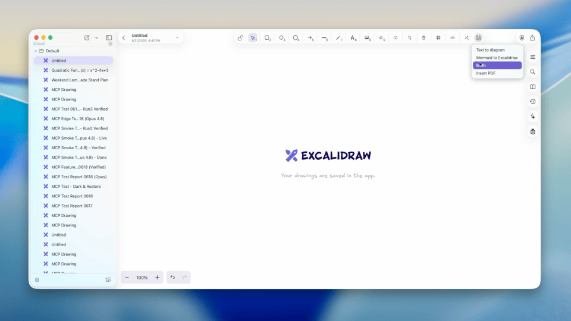
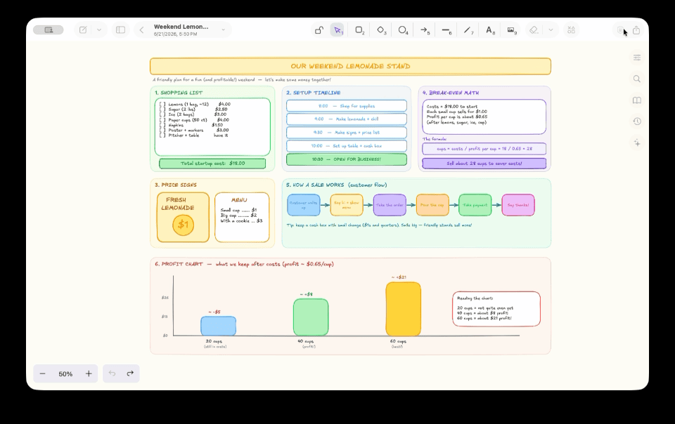

<div align="center" style="display:flex;flex-direction:column;">
  <a href="https://excalidraw.com">
    
  </a>
  <h3>A native Excalidraw client for macOS, iPadOS, and iOS. Powered by SwiftUI.</h3>
</div>

 [](https://x.com/Chocoford_) [](https://discord.gg/aCv6w4HxDg)

<a href="https://www.chocoford.com/donation" target="_blank"></a>

[Excalidraw](https://github.com/excalidraw/excalidraw) is an excellent drawing tool. ExcalidrawZ keeps the familiar Excalidraw canvas, then adds native file management, iCloud sync, history, export, AI assistance, MCP integration, and Apple-platform interaction details around it.

## Download

[](https://apps.apple.com/app/excalidrawz/id6636493997)

**Non-App Store version**

1. Download the latest `.dmg` from [Releases](https://github.com/chocoford/ExcalidrawZ/releases).
2. Open the `.dmg` and drag ExcalidrawZ into Applications.

## Preview


## Features

### Native File Management

ExcalidrawZ manages drawings as real app documents instead of loose browser downloads.

- Organize drawings with groups and custom file sorting.
- Work with ExcalidrawZ library files, local folders, and temporary external files.
- Open and edit `.excalidraw`, `.excalidraw.png`, and `.excalidraw.svg` files directly.
- Sync app-managed files across macOS, iPadOS, and iOS with iCloud.
- Keep file history checkpoints so important changes can be reviewed and restored.

### File History

ExcalidrawZ records checkpoints for app-managed drawings, so you can review earlier versions and restore important work when needed.


### Excalidraw Editing, Native Controls

The canvas remains compatible with Excalidraw while the surrounding app is built for Apple platforms.

- Customize toolbar tool order; number shortcuts follow your configured order.
- Use Apple Pencil on iPad, including familiar undo and redo gestures.
- Use mouse and trackpad scroll and zoom gestures on iPad and iPhone.
- Import PDFs and convert Mermaid diagrams into editable Excalidraw content.

### Collaboration

Use Excalidraw collaboration when you want to draw with others.


### AI Drawing Assistant

ExcalidrawZ includes an AI assistant designed for canvas work.

- Ask AI to read, create, and revise drawings.
- Attach images and let AI use visual context when needed.
- Use proposal previews before applying AI-generated content to the real canvas.
- Control whether each file is visible to AI.
- Use AI from compact iPhone toolbars, iPad floating panels, or the macOS inspector.


### MCP Services

ExcalidrawZ can expose the current app as an MCP server for compatible AI clients.

- Basic mode provides the familiar `excalidraw-mcp` drawing workflow.
- Optimized mode adds deeper ExcalidrawZ integration for current-file editing, file navigation, history, canvas inspection, export, library workflows, and math tools.
- Connect local MCP clients through the app-hosted HTTP endpoint.


### Math and Diagram Tools

ExcalidrawZ includes richer tools for technical drawings and study notes.

- Insert LaTeX-rendered formulas.
- Render function graphs with configurable axes and styles.
- Use reusable math templates and AI-assisted formula generation.
- Edit inserted math images later from the canvas.



### Locked Files and AI Visibility

For sensitive drawings, ExcalidrawZ adds protection around both storage and AI access.

- Lock files with local authentication.
- Encrypt locked files and their checkpoints.
- Use a Recovery Key for fallback access.
- Keep locked content hidden from AI; AI can work through proposal canvases instead.
- Use encrypted backups as an additional recovery path.



### Share, Export, and Backup

ExcalidrawZ supports common export and sharing workflows.

- Export images, editable Excalidraw files, and PDF.
- Preserve editability when exporting `.excalidraw.png` and `.excalidraw.svg`.
- Share through clipboard, files, and the system share sheet.
- Archive app-managed files for backup.


## Supported Formats

ExcalidrawZ can open, import, edit, or export common Excalidraw-related formats:

- `.excalidraw`
- `.excalidraw.png`
- `.excalidraw.svg`
- PDF import and export
- image export

## Contact

Welcome to my [Discord server](https://discord.gg/aCv6w4HxDg) to share suggestions or report issues for ExcalidrawZ.

## Development Guide

- The Excalidraw core used by ExcalidrawZ is also open-source. You can find it [here](https://github.com/chocoford/excalidraw/tree/ExcalidrawZ-core).
- Before you start coding, add your own `Overrides.xcconfig` in `ExcalidrawZ/Config` and populate it with:

```xcconfig
DEVELOPMENT_TEAM = <YOUR_DEVELOPMENT_TEAM_FOR_DEBUG>;
ICLOUD_CONTAINER = <YOUR_ICLOUD_CONTAINER_IDENTIFIER_FOR_DEBUG>;
```
